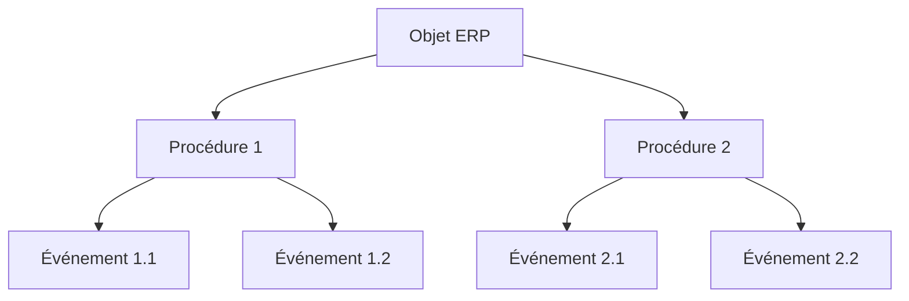
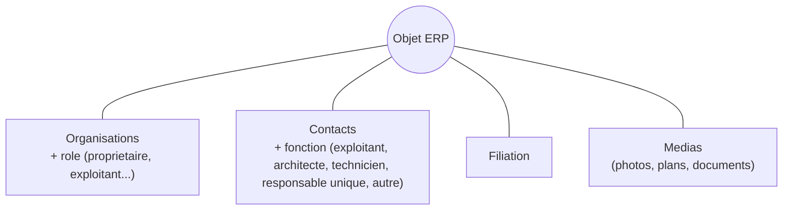
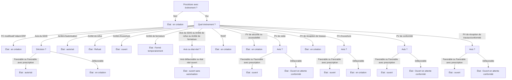

# Documentation fonctionelle de la base de données des ERP (Etablissements Recevants du Public)

## 1. La hiérarchie des ERP

Les ERP sont organisés en **3 niveaux** :

| Niveau | Définition fonctionnelle | Géométrie propre |
|---|---|---|
| **Objet ERP** | Classe descriptive des ERP| non |
| **Procédure** | Classe descriptive des procédures administratives pour chaque ERP | non |
| **Evènement** | Classe descriptive des évènements internes à une procédure | non |

Chaque niveau hérite automatiquement de l'**identifiant** du niveau supérieur.

---
## 2. Les informations transverses liées à un objet ERP

Un objet ERP peut se voir rattacher les objets suivants :

- **Organisations et rôles** : une même entité peut avoir plusieurs organisations rattachées, chacune avec un rôle (propriétaire, nu-propriétaire, exploitant, autre). Le système empêche d'attribuer deux fois le même rôle à la même organisation sur la même entité.
- **Contacts** : chaque contact rattaché à une entité a une fonction ((exploitant, architecte, technicien, responsable unique, autre). Même règle d'unicité que pour les organisations.
- **Filiation** : association particulière, une filiation ne peut s'effectuer uniquement si un ERP est d'abord fermé puis associé au nouvel ERP à la même adresse.
- **Médias** : photos, plans, notices techniques, devis, rapports d'expertise... rattachés librement à une entité.

Les classes attributaires des procédures et des évènements ont seulement les informations transverses de type médias.

---

## 3. Automatismes de saisie

L'essentiel de l'automatisme se situe au niveau de la génération de l'état réglementaire à partir de la saisie des procédures et des évènements.

